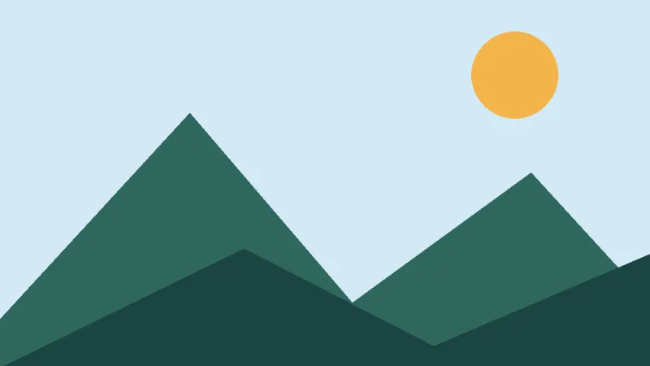

# ALTO Image

ALTO Image builds immutable image requests with predictable output geometry.
It can inspect and plan work before decoding pixels, then render several
derivatives from one source decode with GD or Imagick.

```php
use Alto\Image\Image;

$result = Image::open('photo.jpg')
    ->cover(800, 450)
    ->webp(80)
    ->save('hero.webp');
```

The source remains unchanged and the saved result measures 800 by 450 pixels.
Start with the complete first workflow, then choose pages by task.



## Documentation

- [Installation](installation.md): install the package and inspect available drivers.
- [Getting started](getting-started.md): create and verify a first image derivative.
- [Formats](formats.md): understand known formats and runtime read and write support.
- [Transform](transform.md): resize, crop, compose, and adjust pixels.
- [Encoding](encoding.md): select output formats and compression settings.
- [Image sets](image-sets.md): render several outputs from one source decode.
- [Storage](storage.md): save, cache, and reuse image derivatives.
- [Safety](safety.md): control metadata, resources, and untrusted input.
- [Analysis](analysis.md): extract colours and compare images perceptually.
- [Drivers](drivers.md): choose GD, Imagick, or a third-party implementation.
- [CLI](cli.md): inspect and convert images from the command line.
- [Errors](errors.md): handle package failures at application boundaries.

## Boundaries

Available formats and exact behavior depend on the selected driver and its
compiled delegates. Animated inputs are reduced to their first frame. GD does
not preserve metadata; Imagick support depends on its build. Run
`vendor/bin/image doctor` on each deployment target before relying on a format
or optional capability.
