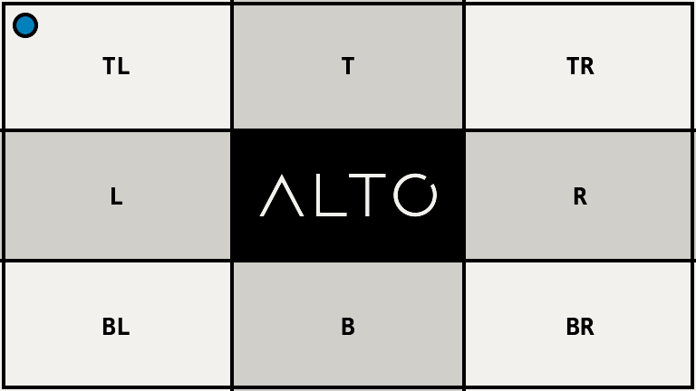

# Adjust

`adjust()` changes brightness, contrast, saturation, and gamma in one pass.

## Example

| Source | Adjusted |
| --- | --- |
|  |  |

```php
use Alto\Image\Image;

Image::open('source-landscape.png')
    ->adjust(brightness: -15, contrast: 30, saturation: -40, gamma: 1.1)
    ->save('adjust.png');
```

## Options

| Option | Default | Range |
| --- | --- | --- |
| `brightness` | `0` | -100 to 100 |
| `contrast` | `0` | -100 to 100 |
| `saturation` | `0` | -100 to 100 |
| `gamma` | `1.0` | 0.1 to 10.0 |

## Edge cases

- Saturation -100 removes colour.
- Extreme values can clip shadows or highlights.
- Dimensions and alpha do not change.

## Driver support

Imagick is exact. GD approximates the requested controls.
