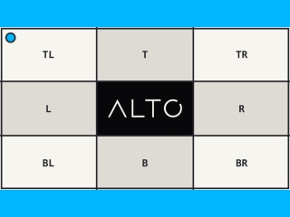

# Contain

`contain()` fits an image inside a box and pads the remaining area.

## Example

| Source: 768 x 432 | Result: 320 x 240 |
| --- | --- |
|  |  |

```php
use Alto\Image\Image;

Image::open('source-landscape.png')
    ->contain(320, 240, background: '#00b7ff')
    ->save('contain.png');
```

## Options

| Option | Default | Use |
| --- | --- | --- |
| `width`, `height` | `null` | Target box |
| `background` | transparent | Padding colour |
| `ratio` | `null` | Target ratio when the box is unresolved |
| `gravity` | `Anchor::Center` | Image placement |
| `scaling` | `Scaling::Down` | Allowed scale direction |

## Edge cases

- A different source ratio adds padding.
- A smaller source is not enlarged by default. The output box shrinks with it.
- Transparent padding requires an alpha-capable output such as PNG or WebP.
- JPEG replaces transparency during encoding. Set an opaque background explicitly.

## Driver support

GD and Imagick support `contain()` exactly.
