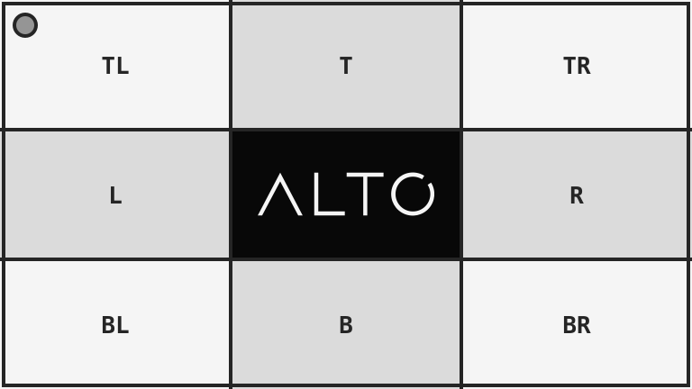

# Convert a colour profile

`convertColourProfile()` transforms pixel values into another colour space.

## Example

| Source: sRGB | Result: gray |
| --- | --- |
|  |  |

```php
use Alto\Image\Image;

Image::open('source-landscape.png')
    ->convertColourProfile('gray')
    ->save('convert-colour-profile.png');
```

## Options

| Option | Default | Use |
| --- | --- | --- |
| `profile` | `srgb` | `srgb`, `gray`, `cmyk`, or an ICC file path |

## Edge cases

- A file path must contain a readable ICC profile.
- Conversion changes pixels. Metadata policy separately controls embedded profiles.
- Converting an image already in the target space can leave it visually unchanged.
- Use `grayscale()` when only a monochrome visual result is needed.

## Driver support

Imagick requires LCMS. GD does not support colour-profile conversion.
