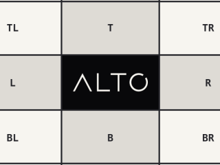

# Cover

`cover()` fills a box and crops the overflow.

## Example

| Source: 768 x 432 | Result: 320 x 240 |
| --- | --- |
|  |  |

```php
use Alto\Image\Image;

Image::open('source-landscape.png')
    ->cover(320, 240)
    ->save('cover.png');
```

## Options

| Option | Default | Use |
| --- | --- | --- |
| `width`, `height` | `null` | Target box |
| `ratio` | `null` | Target ratio when the box is unresolved |
| `gravity` | `Anchor::Center` | Crop placement |
| `scaling` | `Scaling::Down` | Allowed scale direction |

`gravity` accepts an `Anchor`, `Focus`, or `FocalPoint`.

## Edge cases

- A different source ratio is cropped.
- A smaller source is not enlarged by default. Use `Scaling::Both` to force the box size.
- One axis can be omitted. The source ratio supplies the other.
- Width, height, or ratio must be positive.

## Driver support

GD and Imagick support `cover()` exactly.
