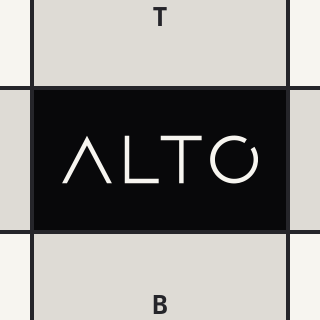
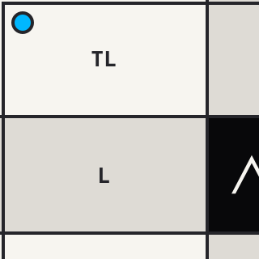
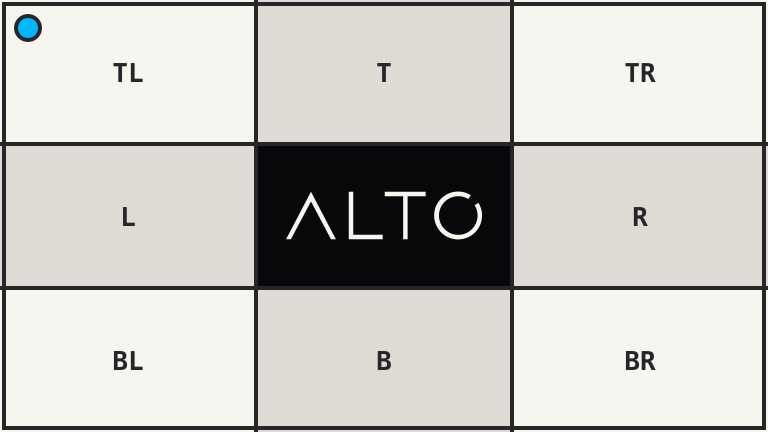

# Crop

`crop()` extracts a rectangle without scaling the source.

## Example

| Source: 768 x 432 | Center: 320 x 320 | Top left: 320 x 320 |
| --- | --- | --- |
|  |  |  |

```php
use Alto\Image\Anchor;
use Alto\Image\Image;

Image::open('source-landscape.png')
    ->crop(320, 320)
    ->save('crop-center.png');

Image::open('source-landscape.png')
    ->crop(320, 320, gravity: Anchor::TopLeft)
    ->save('crop-top-left.png');
```

## Options

| Option | Default | Use |
| --- | --- | --- |
| `width`, `height` | required | Crop size |
| `gravity` | `Anchor::Center` | Crop placement |
| `x`, `y` | `null` | Explicit top-left position |

`gravity` accepts an `Anchor`, `Focus`, or `FocalPoint`.

## Edge cases

- A crop larger than the source is clamped to the source size.
- A different crop ratio removes pixels; it never stretches them.
- Explicit `x` and `y` values are clamped inside the source.
- Pass both coordinates or neither. Coordinates and gravity are mutually exclusive.

An oversized 1200 x 900 crop returns the complete 768 x 432 source:



```php
use Alto\Image\Image;

Image::open('source-landscape.png')
    ->crop(1200, 900)
    ->save('crop-oversize.png');
```

## Driver support

GD and Imagick support `crop()` exactly.
