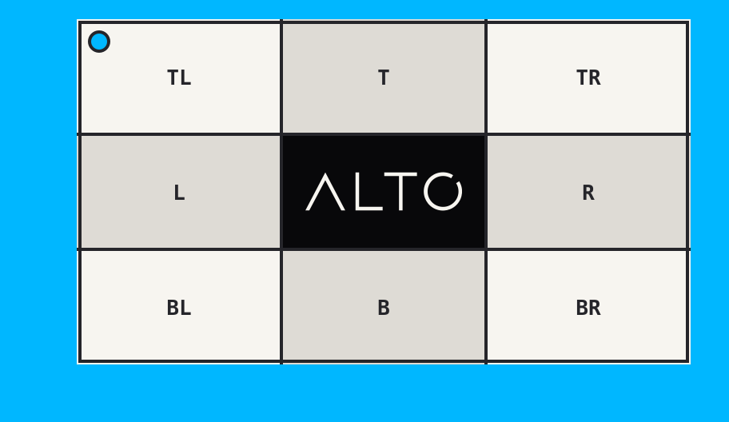

# Extend

`extend()` adds pixels around an image without scaling it.

## Example

| Source: 768 x 432 | Result: 912 x 528 |
| --- | --- |
|  |  |

```php
use Alto\Image\Image;

Image::open('source-landscape.png')
    ->extend(24, 48, 72, 96, '#00b7ff')
    ->save('extend.png');
```

## Options

| Option | Default | Use |
| --- | --- | --- |
| `top` | `0` | Top padding |
| `right` | `null` | Right padding |
| `bottom` | `null` | Bottom padding |
| `left` | `null` | Left padding |
| `background` | transparent | Padding colour |

## Edge cases

- `extend(24)` adds 24 pixels on every side.
- Once another side is passed, omitted sides are zero.
- Padding cannot be negative. Use `crop()` to remove pixels.
- Transparent padding requires an alpha-capable output.

## Driver support

GD and Imagick support `extend()` exactly.
