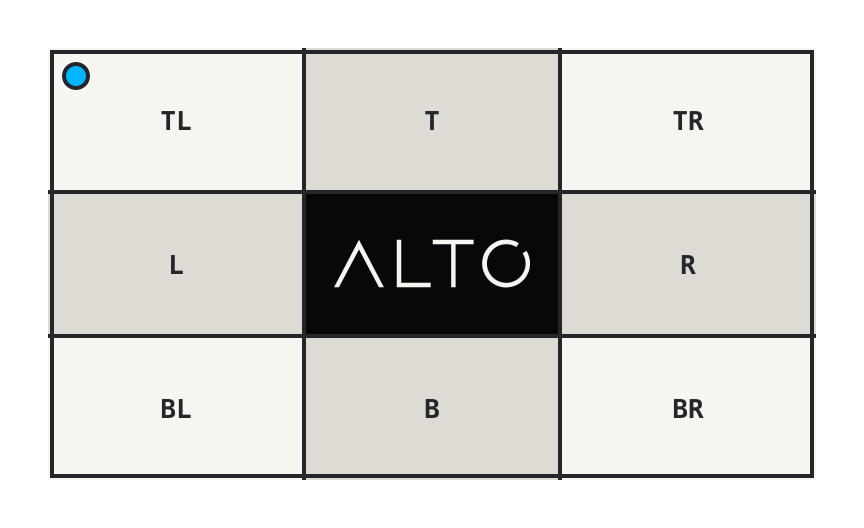
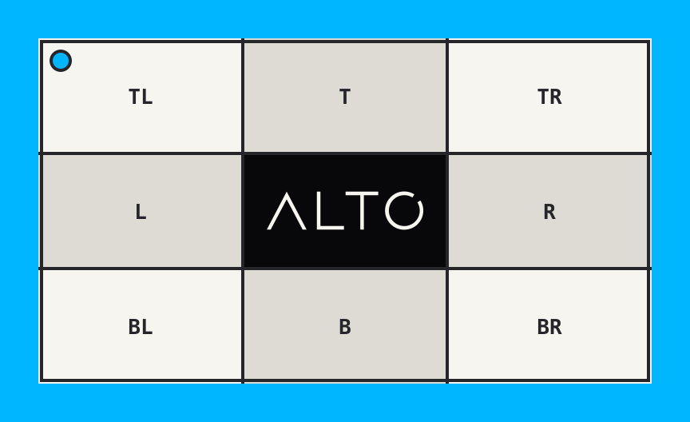

# Flatten

`flatten()` composites transparent pixels onto a background.

## Example

| Transparent source | Cyan background |
| --- | --- |
|  |  |

```php
use Alto\Image\Image;

Image::open('source-transparent.png')
    ->flatten('#00b7ff')
    ->save('flatten.png');
```

## Options

| Option | Default | Use |
| --- | --- | --- |
| `background` | white | Composite colour |

## Edge cases

- An opaque source is unchanged.
- An opaque background removes alpha.
- A transparent background can preserve alpha.
- Flatten before JPEG encoding to control the replacement colour.

## Driver support

GD and Imagick support `flatten()` exactly.
