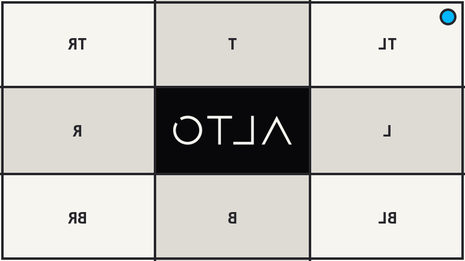
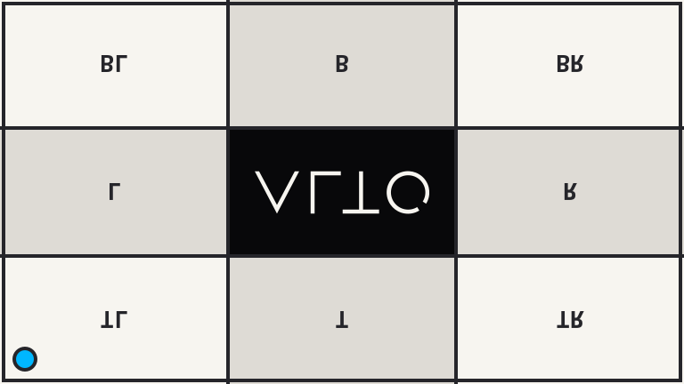

# Flip

`flipHorizontal()` and `flipVertical()` mirror an image on one axis.

## Example

| Source | Horizontal | Vertical |
| --- | --- | --- |
|  |  |  |

```php
use Alto\Image\Image;

Image::open('source-landscape.png')
    ->flipHorizontal()
    ->save('flip-horizontal.png');

Image::open('source-landscape.png')
    ->flipVertical()
    ->save('flip-vertical.png');
```

## Options

No options.

## Edge cases

- Width and height do not change.

## Driver support

GD and Imagick support both flips exactly.
