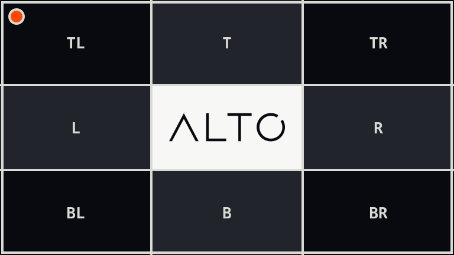

# Invert

`invert()` reverses every colour channel and keeps alpha unchanged.

## Example

| Source | Inverted |
| --- | --- |
|  |  |

```php
use Alto\Image\Image;

Image::open('source-landscape.png')
    ->invert()
    ->save('invert.png');
```

## Options

No options.

## Edge cases

- Dimensions and alpha do not change.

## Driver support

GD and Imagick support `invert()` exactly.
