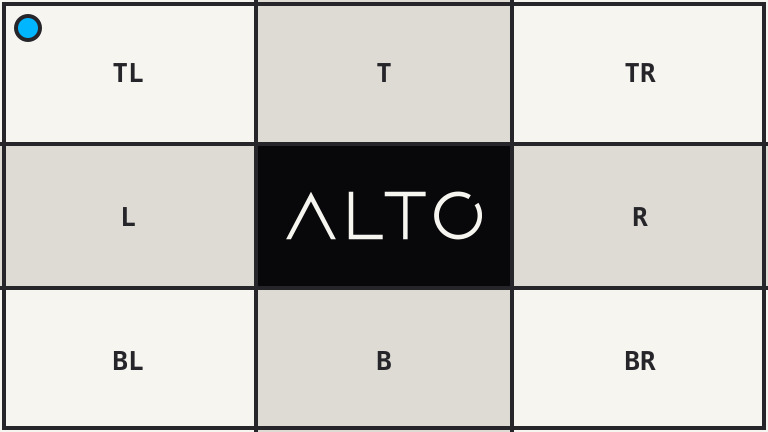
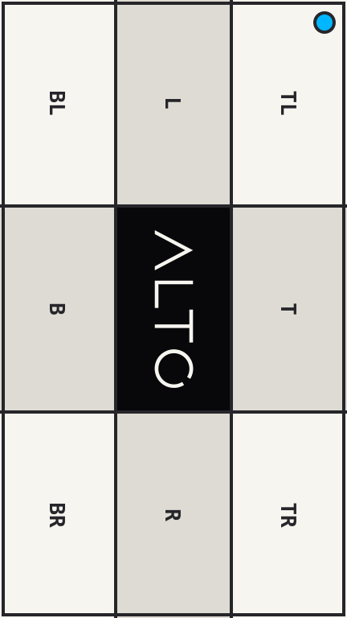

# Orient

ALTO Image applies EXIF orientation automatically. `orient()` records the same
step explicitly in the transform.

## Example

| Stored source: 768 x 432, orientation 6 | Result: 432 x 768, orientation 1 |
| --- | --- |
|  |  |

```php
use Alto\Image\Image;

Image::open('source-orientation.jpg')
    ->orient()
    ->png()
    ->save('orient.png');
```

## Options

No options.

## Edge cases

- Orientation 1 leaves pixels unchanged.
- Orientations 5 through 8 swap width and height.
- Missing orientation metadata is treated as orientation 1.
- The explicit call is optional for ordinary image requests.
- Metadata output remains controlled by the encoding policy.

## Driver support

GD and Imagick support `orient()` exactly.
