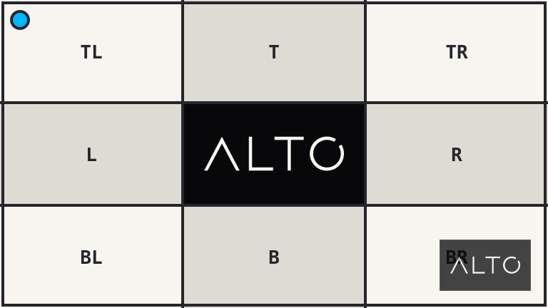

# Overlay

`overlay()` draws another image over the source.

## Example

| Source | Overlay | Result |
| --- | --- | --- |
|  |  |  |

```php
use Alto\Image\Anchor;
use Alto\Image\Image;

Image::open('source-landscape.png')
    ->overlay('overlay-mark.png', Anchor::BottomRight, opacity: 0.75, margin: 24)
    ->save('overlay.png');
```

## Options

| Option | Default | Use |
| --- | --- | --- |
| `path` | required | Overlay image |
| `gravity` | `Anchor::BottomRight` | Placement |
| `opacity` | `1.0` | Opacity from 0.0 to 1.0 |
| `margin` | `0` | Distance from the anchored edge |

## Edge cases

- The overlay is not resized. Resize it first when needed.
- Content outside the source canvas is clipped.
- Treat user-controlled paths as untrusted input.

## Driver support

GD and Imagick support `overlay()` exactly.
