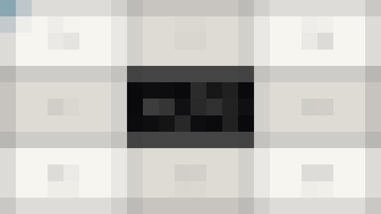

# Pixelate

`pixelate()` replaces regions with averaged square blocks.

## Example

| Source | 32-pixel blocks |
| --- | --- |
|  |  |

```php
use Alto\Image\Image;

Image::open('source-landscape.png')
    ->pixelate(32)
    ->save('pixelate.png');
```

## Options

| Option | Default | Use |
| --- | --- | --- |
| `size` | `8` | Block size in pixels |

## Edge cases

- Block size must be at least 2.
- A block larger than the image can reduce it to one colour region.
- Dimensions and alpha do not change.
- Pixelate after resizing for a stable apparent block size.

## Driver support

GD and Imagick support `pixelate()` exactly.
