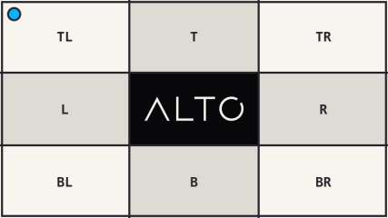

# Resize

`resize()` exposes the fit, placement, and scaling policies directly.

## Example

| Source: 768 x 432 | Result: 427 x 240 |
| --- | --- |
|  |  |

```php
use Alto\Image\Fit;
use Alto\Image\Image;

Image::open('source-landscape.png')
    ->resize(320, 240, fit: Fit::Outside)
    ->save('resize.png');
```

## Options

| Option | Default | Use |
| --- | --- | --- |
| `width`, `height` | `null` | Target box |
| `fit` | `Fit::Inside` | Box behavior |
| `ratio` | `null` | Deferred target ratio |
| `gravity` | `Anchor::Center` | Crop or padding placement |
| `scaling` | `Scaling::Down` | Allowed scale direction |

## Edge cases

- `Fit::Inside` and `Fit::Outside` preserve the ratio but do not promise the box size.
- `Fit::Cover`, `Fit::Contain`, and `Fit::Fill` produce the box ratio.
- A smaller source is not enlarged by default.
- Prefer a named method when its behavior matches the request.

## Driver support

GD and Imagick support `resize()` exactly.
