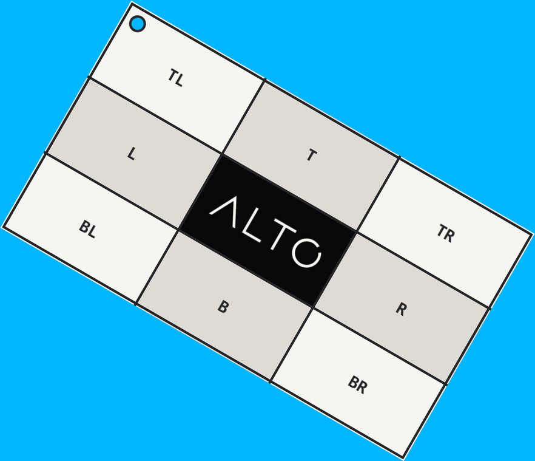

# Rotate

`rotate()` turns an image and expands the canvas to keep every corner.

## Example

| Source: 768 x 432 | Result: 882 x 759 |
| --- | --- |
|  |  |

```php
use Alto\Image\Image;

Image::open('source-landscape.png')
    ->rotate(30, background: '#00b7ff')
    ->save('rotate.png');
```

## Options

| Option | Default | Use |
| --- | --- | --- |
| `degrees` | required | Clockwise angle |
| `background` | transparent | Exposed canvas colour |

## Edge cases

- Angles are normalized between 0 and 360 degrees.
- Quarter turns swap width and height when needed.
- Other angles enlarge both axes.
- The angle must be finite.

## Driver support

GD is exact. Imagick is exact for quarter turns and approximate for other angles.
