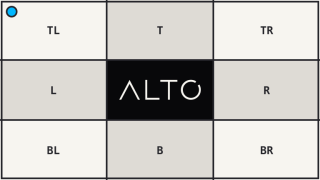

# Scale

`scale()` sets one axis and preserves the source ratio.

## Example

| Source: 768 x 432 | Result: 320 x 180 |
| --- | --- |
|  |  |

```php
use Alto\Image\Image;

Image::open('source-landscape.png')
    ->scale(width: 320)
    ->save('scale.png');
```

## Options

| Option | Default | Use |
| --- | --- | --- |
| `width` | `null` | Target width |
| `height` | `null` | Target height |
| `scaling` | `Scaling::Down` | Allowed scale direction |

## Edge cases

- Pass either `width` or `height`, not both.
- A smaller source is unchanged by default.
- The calculated axis is rounded to the nearest pixel.
- Use `fit()` or `stretch()` when both axes matter.

## Driver support

GD and Imagick support `scale()` exactly.
