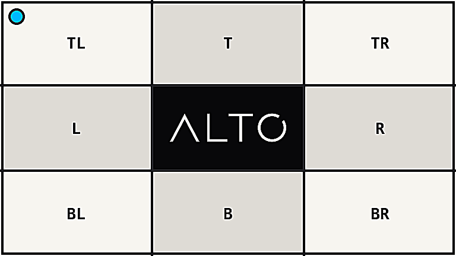

# Sharpen

`sharpen()` increases local edge contrast with an unsharp mask.

## Example

| Source | Sharpened |
| --- | --- |
|  |  |

```php
use Alto\Image\Image;

Image::open('source-landscape.png')
    ->sharpen(sigma: 1.2, amount: 2.5)
    ->save('sharpen.png');
```

## Options

| Option | Default | Use |
| --- | --- | --- |
| `sigma` | `1.0` | Edge radius |
| `amount` | `1.0` | Added edge contrast, from 0.0 to 5.0 |

## Edge cases

- Sigma must be finite and greater than zero.
- Amount 0 leaves pixels unchanged.
- High amounts can create halos.
- Sharpen after resizing for the final output size.

## Driver support

Imagick is exact. GD uses an approximate convolution.
