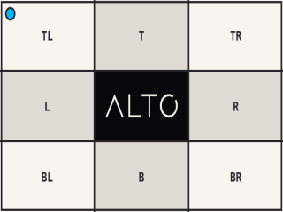

# Stretch

`stretch()` scales each axis independently to fill a box.

## Example

| Source: 768 x 432 | Result: 320 x 240 |
| --- | --- |
|  |  |

```php
use Alto\Image\Image;

Image::open('source-landscape.png')
    ->stretch(320, 240)
    ->save('stretch.png');
```

## Options

| Option | Default | Use |
| --- | --- | --- |
| `width`, `height` | required | Target box |
| `scaling` | `Scaling::Down` | Allowed scale direction per axis |

## Edge cases

- A different source ratio is distorted.
- A smaller source is not enlarged by default.
- Mixed scaling can change only one axis when `Scaling::Down` or `Scaling::Up` clamps the other.
- Use `cover()` to fill without distortion.

## Driver support

GD and Imagick support `stretch()` exactly.
