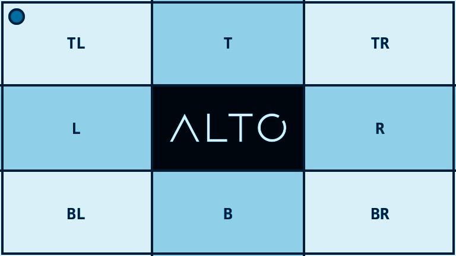

# Tint

`tint()` maps an image onto one hue while keeping luminance.

## Example

| Source | Cyan tint |
| --- | --- |
|  |  |

```php
use Alto\Image\Image;

Image::open('source-landscape.png')
    ->tint('#00b7ff', strength: 0.7)
    ->save('tint.png');
```

## Options

| Option | Default | Use |
| --- | --- | --- |
| `colour` | required | Target hue |
| `strength` | `1.0` | Tint strength from 0.0 to 1.0 |

## Edge cases

- Strength 0 produces the neutral luminance image.
- Strength 1 applies the full tint while retaining light and dark regions.
- Dimensions and alpha do not change.

## Driver support

Imagick is exact. GD approximates tint with grayscale and colourization filters.
