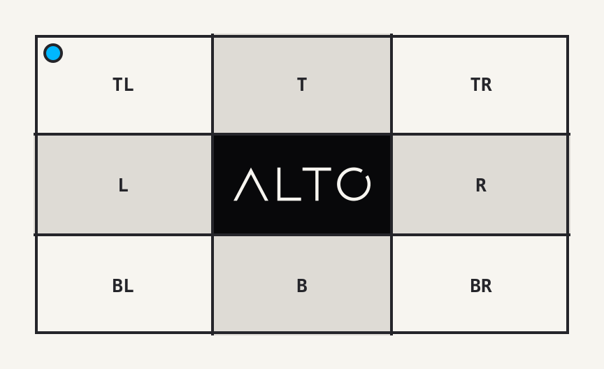
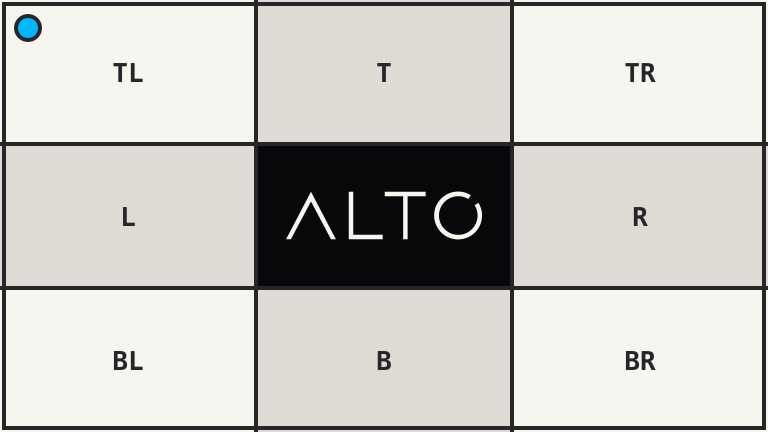

# Trim

`trim()` removes a uniform border from an image.

## Example

| Source: 864 x 528 | Result: 768 x 432 |
| --- | --- |
|  |  |

```php
use Alto\Image\Image;

Image::open('source-trim.png')
    ->trim(background: '#f7f5f0')
    ->save('trim.png');
```

## Options

| Option | Default | Use |
| --- | --- | --- |
| `threshold` | `10` | Per-channel colour tolerance, from 0 to 255 |
| `background` | corner pixel | Colour to remove |

## Edge cases

- A zero threshold requires an exact colour match.
- A high threshold can remove content close to the border colour.
- The final size depends on pixels. Before rendering, `size()` returns the source upper bound.
- An image without a matching border is unchanged.

## Driver support

GD and Imagick support `trim()` exactly.
